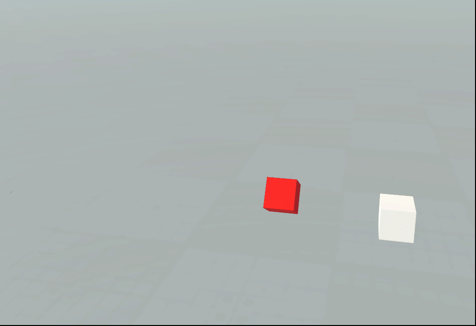

> ## 构件是否可选

> ## 设置构件

- 设置构件颜色
   - 设置颜色
     
   - 清除颜色
- 设置构件属性
   - 设置属性
    设置构件额外的属性，可用于区分标志。
   - 获取属性
    获取设置的属性
- 设置构件的显示隐藏
   - 一般用于场景比较复杂的场景，需要把场景由繁去简的场合。目的是更准确的更直观的看到特定的构件 .
- 设置构件的显示隐藏

> ## billboard

- 创建关联
- 根据类型获取billboard列表
- 获取关联的构件
- 移除billboard
- 根据类型移除billboard
- 根据路径设置billboard展示内容
- 根据url设置billboard展示内容
- 显示/隐藏billboard
- 根据类型显示/隐藏billboard

> ## 获取构件信息

- 获取构件信息,查看构件的具体信息。
> ## 根据工程Id获取构件信息

- 根据工程Id,查看构建信息列表。
> ## 获取构件坐标

- 获取构件坐标,一般用于根据坐标做定位效果。
> ## 删除构件