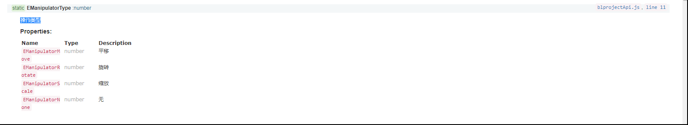
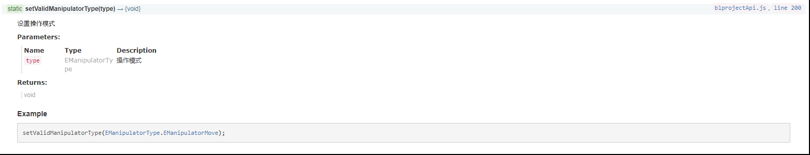
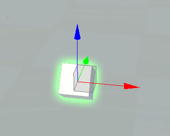
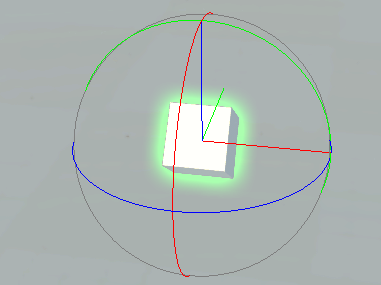
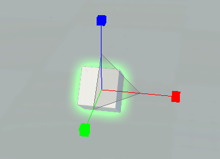
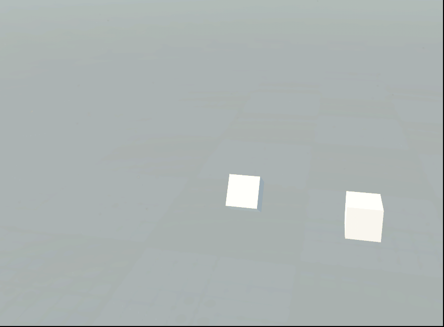

> ## 打开工程

- 打开工程，对构件进行平移、旋转、缩放，以及一些构件信息的读取等等。

> ## 保存工程

- 构件一系列的操作后保存下次就是操作的结果，不保存就回到最初的状态。

> ## 获取工程信息

- 获取所有工程信息列表
   - 获取所有工程列表，一般用于数据统计，会以列表的形式呈现出来，目的是更直观的展示给用户。
- 获取当前工程信息
   - 获取工程信息  单条悬浮框展示，主要展示一些位置，类型，名称等信息。
- 获取主要工程信息
   - 试了一下跟获当前工程信息是一样的。具体的后面跟客户端那边再沟通吧。
   
> ## 工程操作

- 操作类型：平移、旋转、缩放、无。

 
 

 
 
 
> ## FBX模型

- 导入FBX模板
导入FBX模板需要在CIM那边进行 这边暂时不支持。
- 部署FBX模型
导入FBX后，在场景里面安放已经导入的模型到制定的位置。然后保存。
- 获取FBX列表