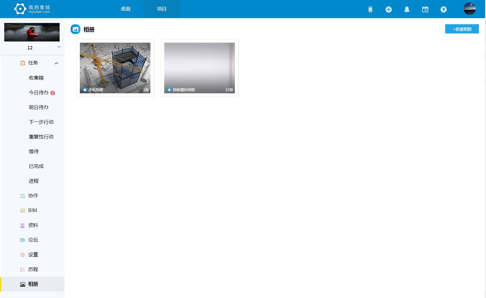
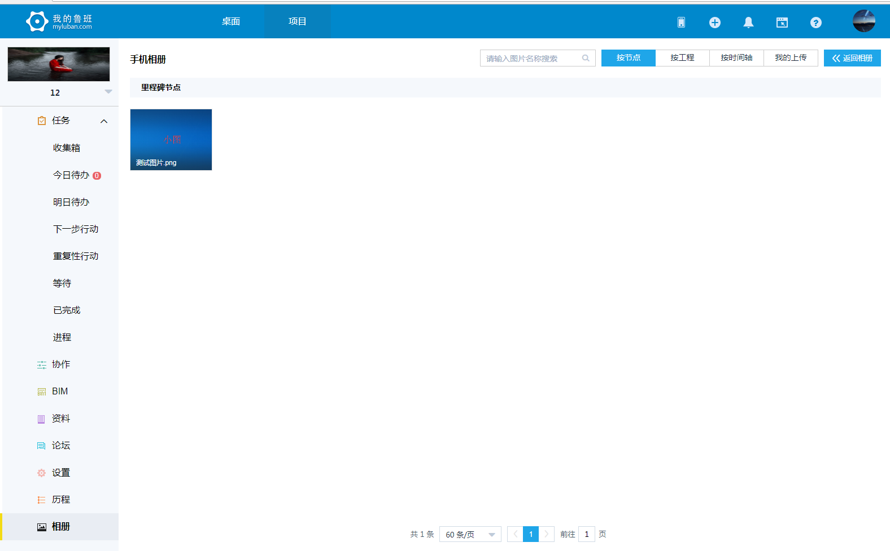
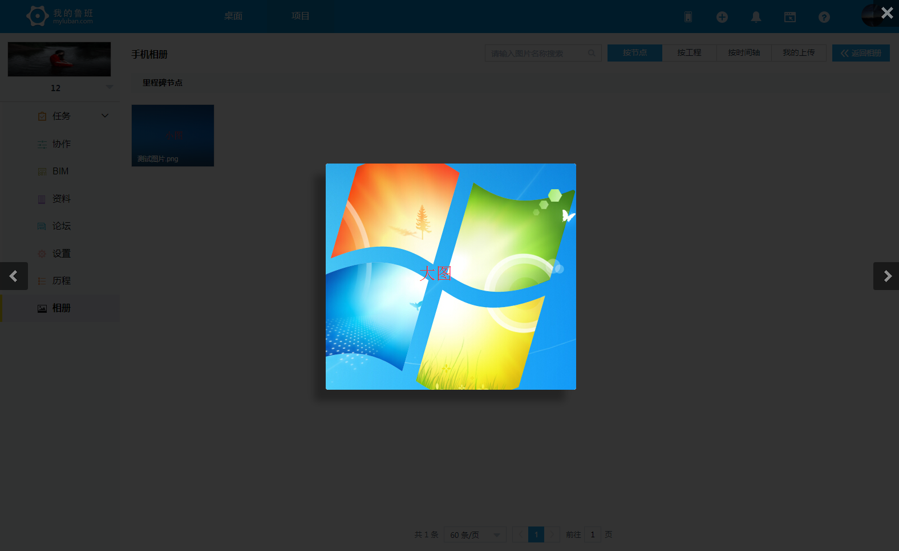
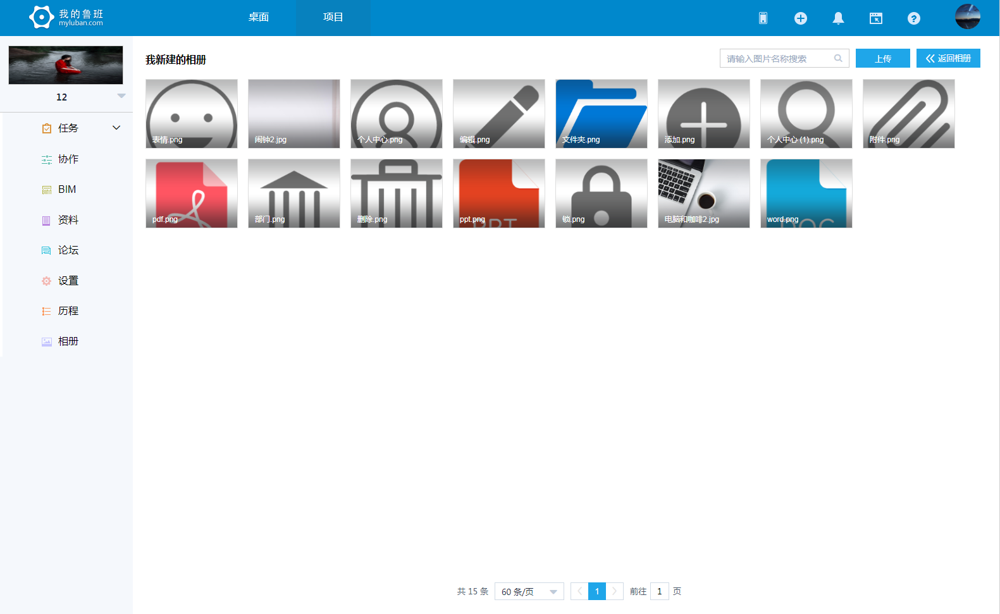
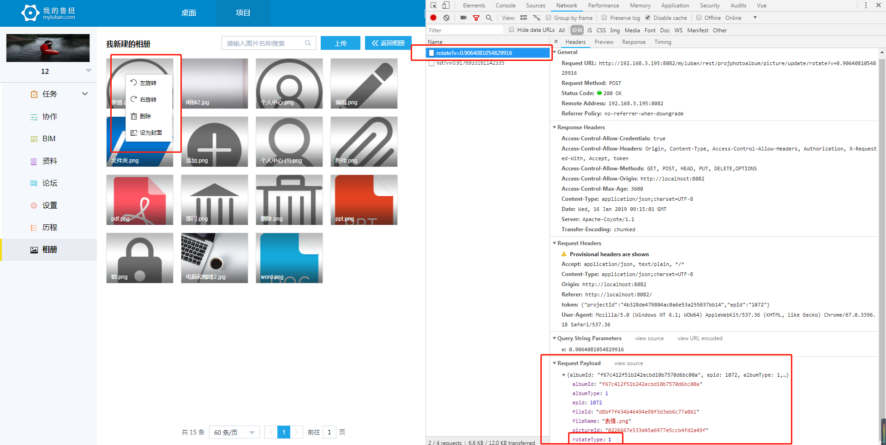
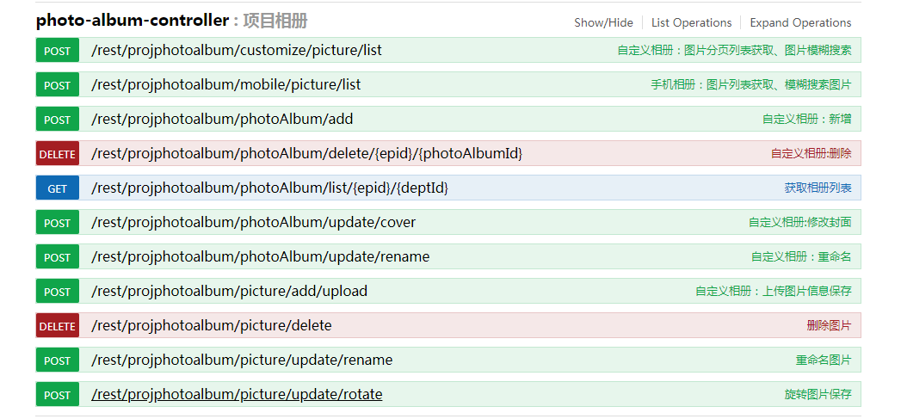

> ## 相册列表

- 相册权限，有相册权限或者是超管的可创建相册也可进入相册内部操作图片修改、删除、旋转、设置封面等的操作，没有权限只能查看。
- 相册不可重名，新建/更新重名都可直接刷接口复原。
- 相册可分为手机相册、自定义相册。手机相册是myluban-app对应的图片，自定义相册是myluban-web创建相册。
- 手机相册不能删除，不可修改，不可设置封面。
- 相册可看到信息相册名称，相册图片总数。
- 如果有相册权限，点击相册名可修改，失焦保存。

 

> ## 手机相册

- 手机相册：按节点分、按工程、按时间轴、我的上传四部分组成。
- 手机相册如果有权限只能操作我的上传（删除，左旋转，右旋转），没有权限对应上传功能隐藏。
- 手机相册不可设置封面。
- 手机相册我的上传图片添加可通过右上角的上传方式添加上传，上传方式：我的上传，资料上传，进度照片（格式支持jpg,jpeg,png,bmp，大小限制5M）。
- 返回相册快速返回相册列表的方式。
- 图片名修改图片名称，默认聚焦格式以外的部分，失焦保存。
- 图片不可同名，格式相同的情况，不同格式可重名。
- 图片误操作改变格式，或者同名都是后端给出提示。
 
- 点击图片进行图片预览。
 

> ## 自定义相册

- 自定义相册如果有权限可对图片操作（删除，左旋转，右旋转,设置封面），修改名称，没有权限上传功能隐藏，只支持查看。
- 自定义相册如果已经设置封面或者是当前设置封面“设置封面”去掉，通过改变link传参实现。
- 自定义相册我的上传图片添加可通过右上角的上传方式添加上传，上传方式：我的上传，资料上传，进度照片（格式支持jpg,jpeg,png,bmp，大小限制5M）。
- 返回相册快速返回相册列表的方式。
- 图片名修改图片名称，默认聚焦格式以外的部分，失焦保存。
- 图片不可同名，格式相同的情况，不同格式可重名。
- 图片误操作改变格式，或者同名都是后端给出提示。
 

> ## 图片旋转

 - 图片旋转目前是后端做的，做响应的操作只需要传左右对应的值就好了。如果后期牵扯此功能，可考虑canvas操作图片。
 

> ## 历程接口图

 