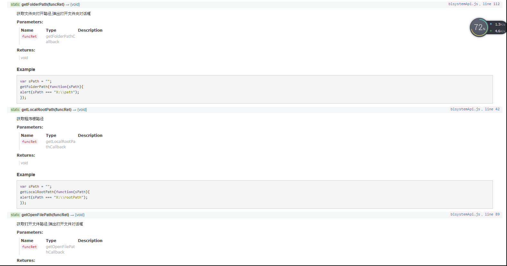
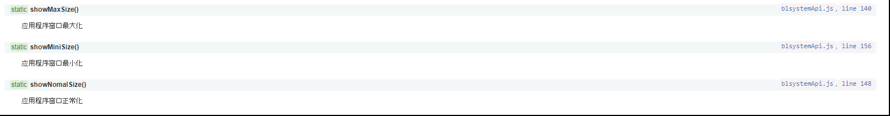
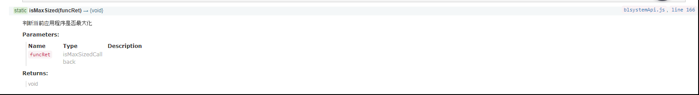
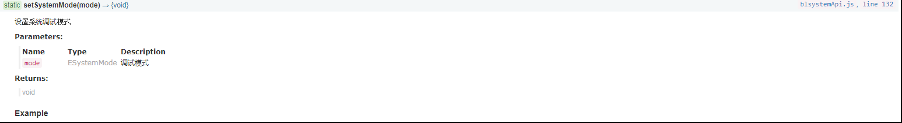
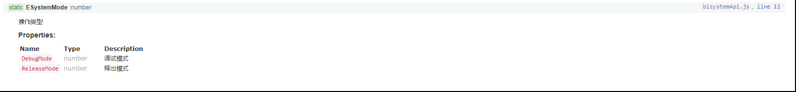

> ## 上传、下载方法

> ## 系统相关操作

- 程序窗口

- 应用程序窗口最大化
- 应用程序窗口最小化
- 应用程序窗口正常化

- 应用程序初始化的状态 ps:应用程序是否最大化

> ## 系统调试

- 系统调试是否调出调试窗口 可通过客户端提供的方法启动调试窗口。

> ## 设置Cim平台Token

token的目的是为了减轻服务器的压力，减少频繁的查询数据库