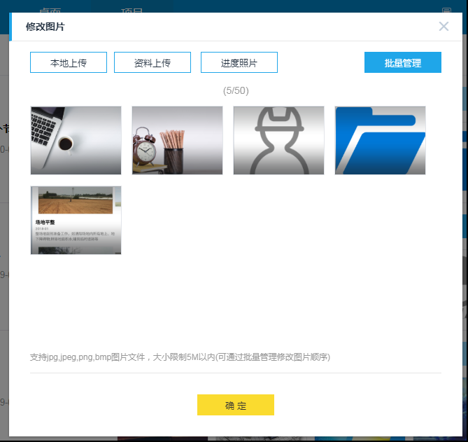
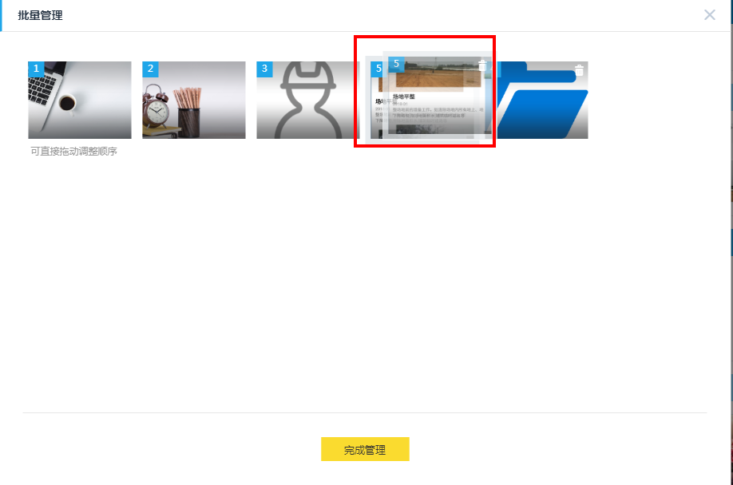
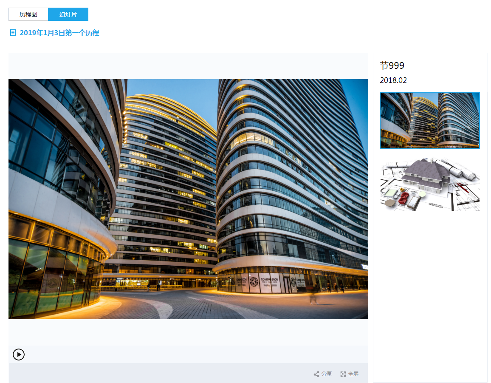
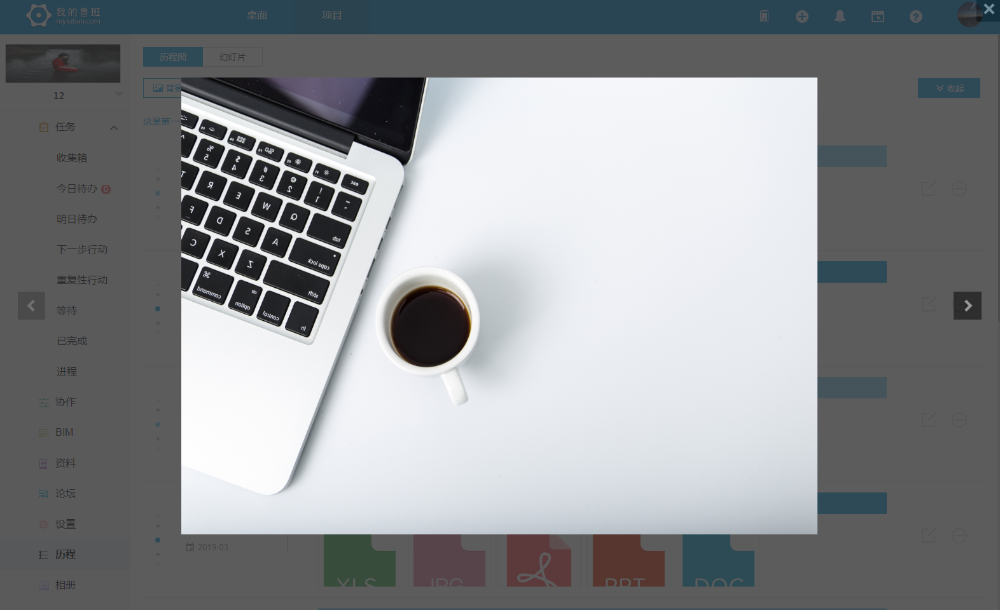
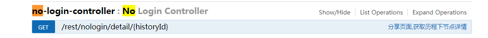
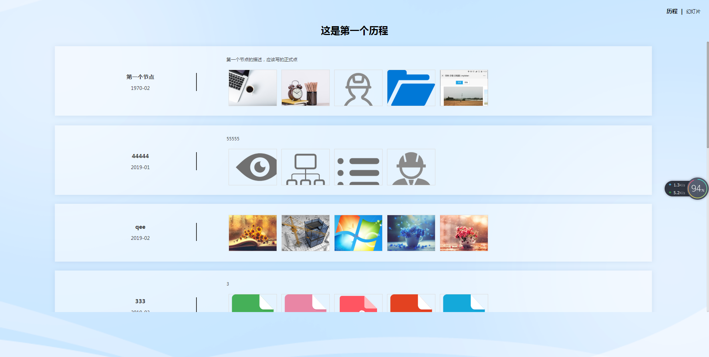
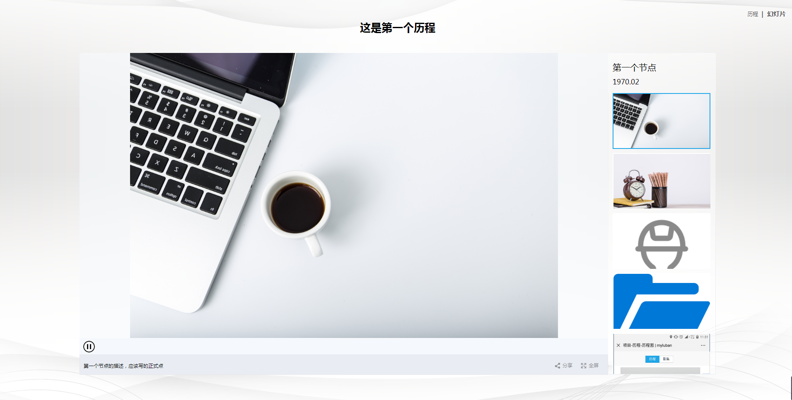
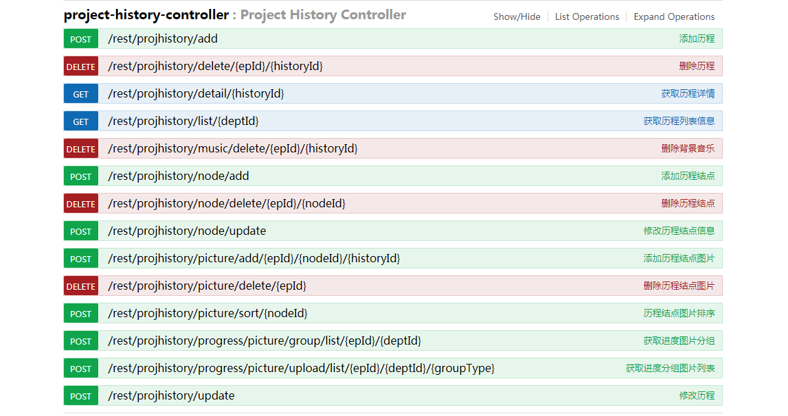

>## 历程-历程图

   - 创建历程,历程名称不能为空，非空条件可启动创建子节点还有一些其他历程的设置（设置背景，上传/更换音乐、删除、分享、预览，创建）。
   - 历程是根据有没有权限或者超管有权限创建，否则只能查看**myluban/rest/user/auth/1072。**
   - 节点名称和节点时间不能为空（日期格式YYYY-MM）。
   - 创建历程/更新历程、创建历程节点/更新节点实现如图所示：

历程名称|节点名称|节点时间|节点描述
---|:--:|---:|---:|
失焦保存|失焦保存|失焦保存|失焦保存

- 图片操作：本地上传、资料上传、进度照片、批量操作（图片排序） 
   - 单个历程节点上传图片<=50，所有来源的和不得超过50张。
   - 上传格式支持jpg,jpeg,png,bmp，大小限制5M。
   - 上传缩略图功能upload-dialog.vue文件里面写的有方法,后期有需要可直接使用。
   - 后期如果牵扯图片旋转尝试Canvas。
   - 上传方式
    

   - 图片管理
    

>## 历程-幻灯片

- 历程幻灯片展示历程图的所有图集集合。该功能自动播放幻灯片,幻灯片播放过程中可以暂停/开始，全屏、分享（手机扫码和link前往），节点描述以字幕的形式展示。
 

> ## 历程预览

- 历程预览用于预览单个历程节点的图集，实现方法缩略图swiper一一对应大图的swiper，显隐对应的数据。
- 左右箭头切换底，箭头无效。
- 右上角关闭预览框。
 

> ## 分享历程

- 分享预览分手机端预览，PC端预览。手机端根据设备比例动态计算的单位是rem，根据设备配置对应的页面；手机端支持扫码查看或者link查看,pc可以直接link查看。如果在历程中直接分享或者预览打开新的页签。
   - 分享接口是单独开的，不用验证登录，只需要历程不存在给出提示。
   - 分享页面支持查看功能，不具备修改功能。
       
   - 分享包括历程/幻灯片，历程页面包括节点展示，节点图预览。幻灯片图片集无限循环播放，还有背景音乐。
   - 分享手机端功能同pc端只是页面展示样式不一样，逻辑数据一样就不展示了。
    
    

> ## 历程接口图

 
