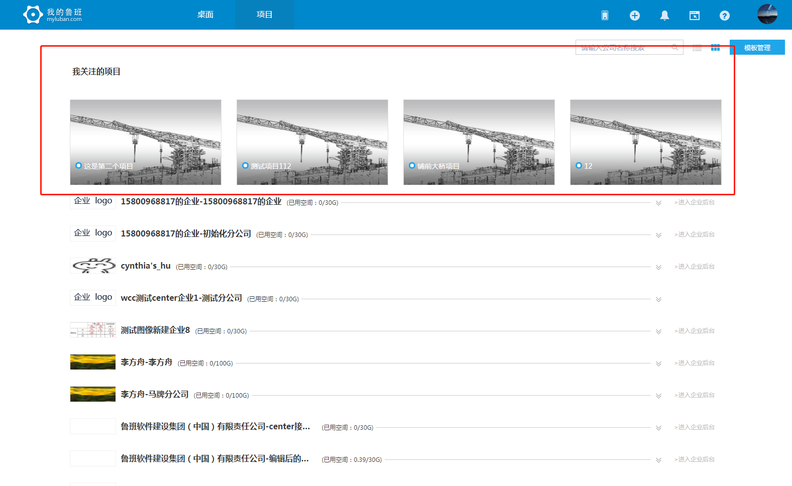
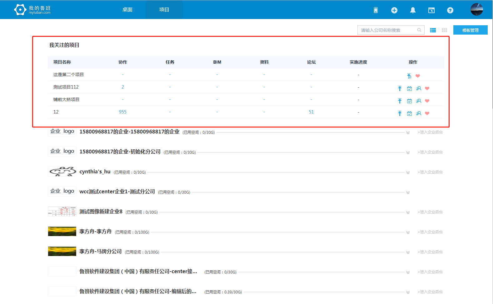
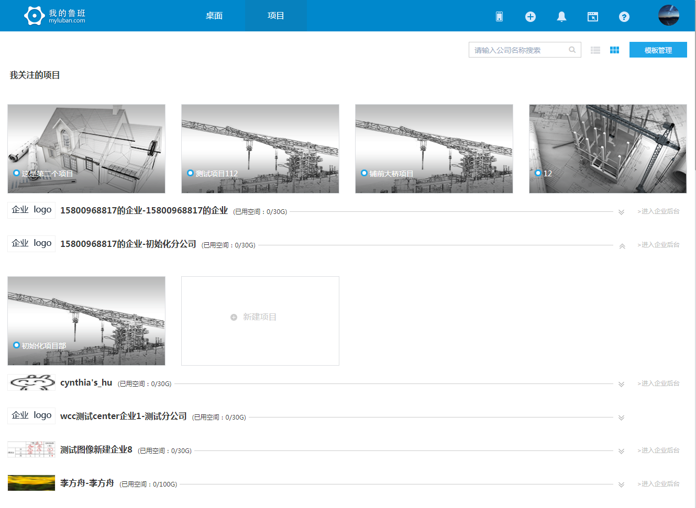
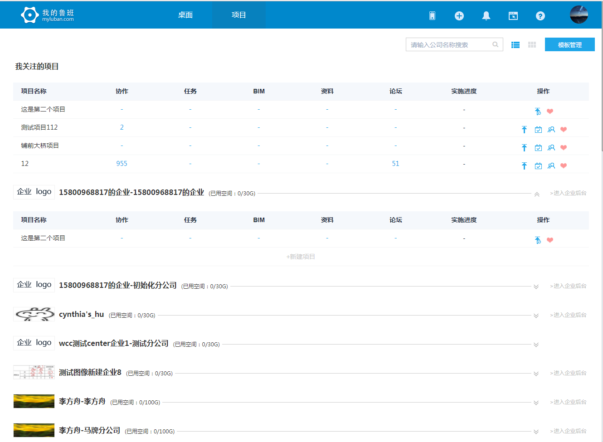
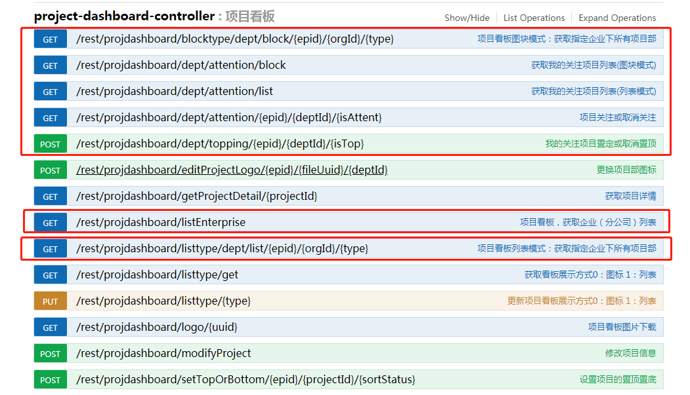

> ## 项目收藏

- 项目看板分块状和列表两种形式，效果如图：
 
 
- 项目看板有：取关、置顶、取消置顶功能。
- 项目收藏不在搜索范围之内。
- 项目收藏全部展示出来，没有分页，出现在最上方。排序顺序：置顶、收藏顺序。
- 项目收藏除新增功能以外其他功能同原来。
- 项目收藏没有收藏数据，我的关注部分不展示。

> ## 项目看板调整

- 考虑到网速慢的问题，v1.4.1版本把原来的一个接口改成了两个接口公司+项目部。
- 项目看板公司和项目是分开的，项目部数据展开获取。
- 项目看板增加收藏功能，收藏和非收藏两种状态。
- 项目看板项目部一次只支持展开一个项目部。

 
 

> ## 项目调整接口

- 项目看板v1.4.1版本修改对应的接口
 